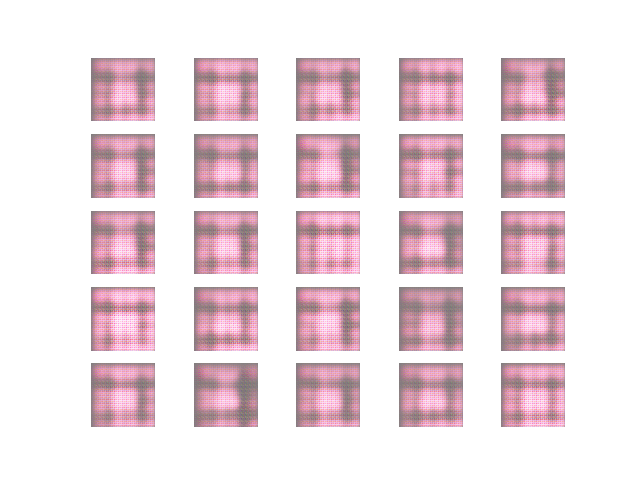
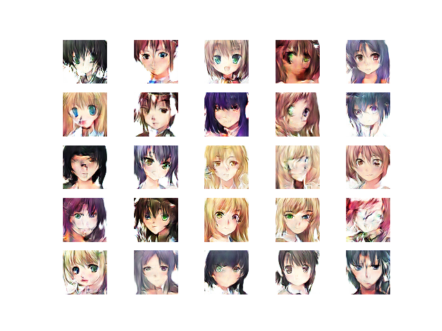
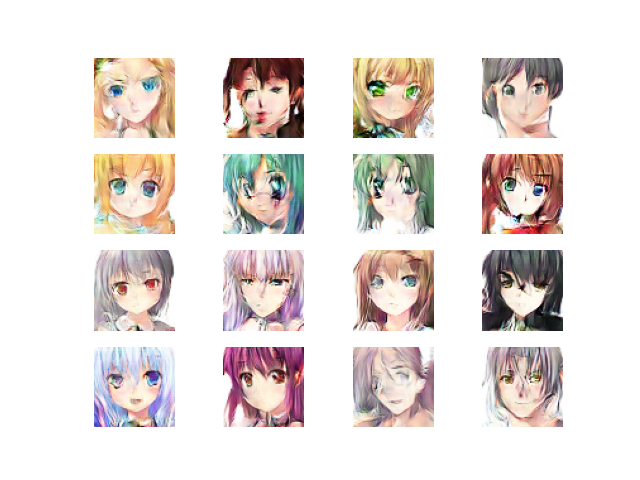
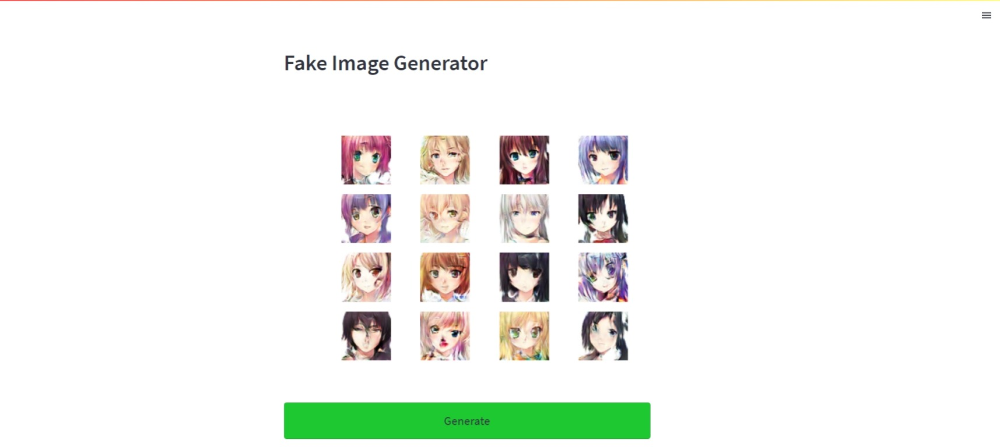

# DCGAN-on-Anime-Faces

The respository contains the code for the Deep Convolutional Generative Adversarial Network (DCGAN) trained on the anime faces dataset.  
  

There are three files:
- gan.py: It is used to train the DCGAN on the anime faces dataset.
- test.py: This file loads the saved generator model and generates some fake samples and save them with the name fake.png
- stream.py: It is a streamlit file which provides a simple GUI with image and a button to generate a fake image
## Dataset
Download the dataset and put all the images in the data folder. 
Link: [https://www.kaggle.com/soumikrakshit/anime-faces](https://www.kaggle.com/soumikrakshit/anime-faces)

## Training samples
|  |
|:--:| 
| *Image at epoch 1* |

|  |
|:--:| 
| *Image at epoch 60* |

## Fake samples generated after training
|  |
|:--:| 

## Screen shot of the GUI (streamlit)
|  |
|:--:|
